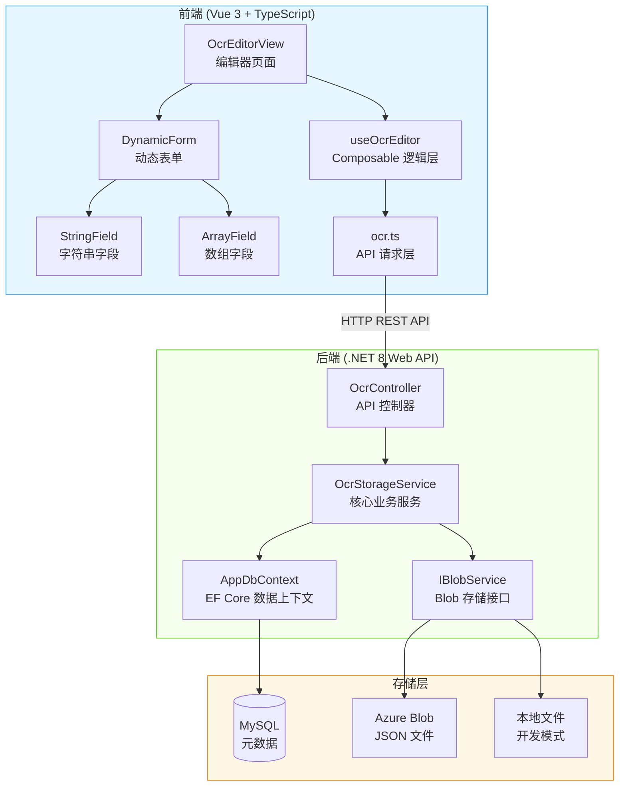
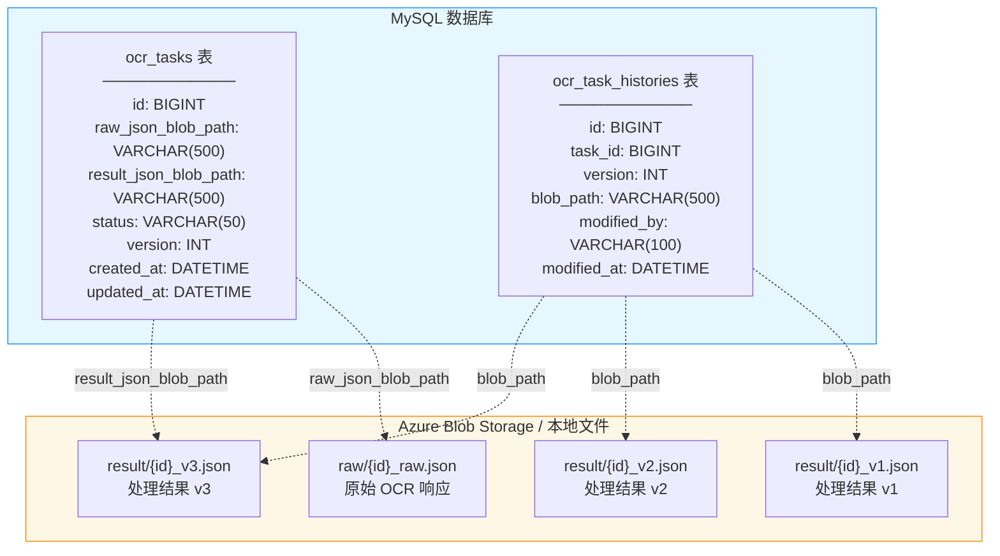
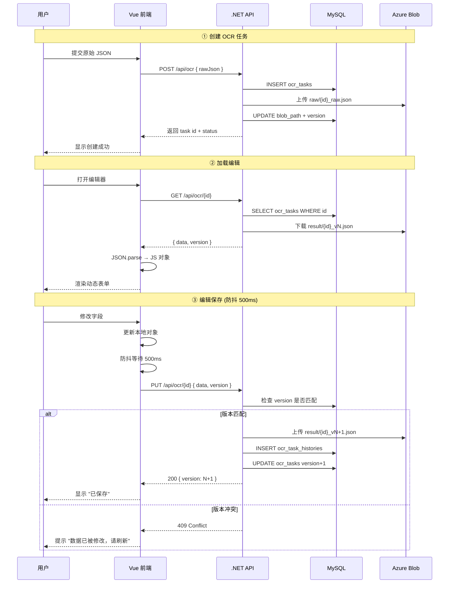
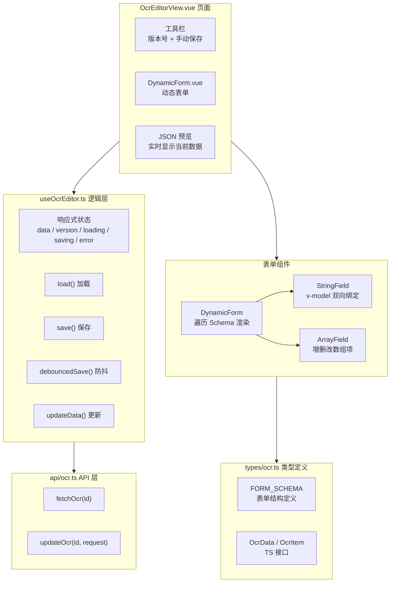

# WorkDemo

个人技术想法 Demo 仓库，包含各种前后端技术方案的实践代码。

---

## OcrDemo - OCR JSON 存储方案

基于 .NET 8 + ASP.NET Core + EF Core + MySQL + Azure Blob + Vue 3 + TypeScript 的 OCR 数据处理与存储方案。

---

## 系统架构图



---

## 数据流全景图

```mermaid
flowchart LR
    subgraph OCR["OCR 平台"]
        OCR_API[OCR WebAPI]
    end

    subgraph Server["后端处理"]
        RECEIVE[接收原始 JSON]
        SAVE_RAW[保存原始 JSON 到 Blob]
        DESERIALIZE[反序列化 → 业务对象]
        PROCESS[业务处理]
        SERIALIZE[序列化 → JSON]
        SAVE_RESULT[保存处理结果到 Blob]
    end

    subgraph Frontend_Edit["前端编辑"]
        LOAD[加载 JSON → 对象]
        FORM[动态表单编辑]
        STRINGIFY[对象 → JSON]
        SEND[发送更新请求]
    end

    subgraph Concurrency["并发控制"]
        LOCK[乐观锁版本检查]
        CONFLICT{版本冲突?}
        HISTORY[历史版本记录]
    end

    OCR_API -->|HTTP 响应 JSON| RECEIVE
    RECEIVE --> SAVE_RAW
    RECEIVE --> DESERIALIZE
    DESERIALIZE --> PROCESS
    PROCESS --> SERIALIZE
    SERIALIZE --> SAVE_RESULT

    SAVE_RESULT --> LOAD
    LOAD --> FORM
    FORM --> STRINGIFY
    STRINGIFY --> SEND
    SEND --> LOCK
    LOCK --> CONFLICT
    CONFLICT -->|否| SAVE_RESULT
    CONFLICT -->|否| HISTORY
    CONFLICT -->|是 409| LOAD
```



---

## 存储架构详解



**设计原则：**

| 存储位置 | 存储内容 | 作用 |
|---------|---------|------|
| MySQL | 元数据（路径、状态、版本号） | 快速查询、索引、状态管理 |
| Azure Blob | 完整 JSON 文件 | 大文件存储、版本管理、高性能读写 |
| 本地文件 | 开发模式替代 Blob | 无需 Azure 账号即可本地开发 |

---

## 请求处理流程



---

## 乐观锁并发控制机制

```mermaid
flowchart TD
    A[用户A 加载数据<br/>version = 3] --> B[用户A 编辑...]
    C[用户B 加载数据<br/>version = 3] --> D[用户B 编辑...]

    D --> E[用户B 先保存<br/>PUT { version: 3 }]
    E --> F{version 匹配?}
    F -->|是 3 == 3| G[保存成功<br/>version → 4]

    B --> H[用户A 后保存<br/>PUT { version: 3 }]
    H --> I{version 匹配?}
    I -->|否 3 != 4| J[409 Conflict<br/>提示刷新]

    G --> K[用户A 刷新页面]
    K --> L[获取最新数据<br/>version = 4]
    L --> M[重新编辑保存]
```

---

## 前端组件架构



---

## 项目结构

```
WorkDemo/
├── README.md
├── .gitignore
├── backend/                          # .NET 8 Web API
│   ├── Models/
│   │   ├── OcrTask.cs                # 任务实体（含乐观锁版本号）
│   │   └── OcrTaskHistory.cs         # 历史版本实体
│   ├── Data/
│   │   └── AppDbContext.cs           # EF Core DbContext
│   ├── Services/
│   │   ├── IBlobService.cs           # Blob 存储接口
│   │   ├── AzureBlobService.cs       # Azure Blob 实现
│   │   ├── LocalFileBlobService.cs   # 本地文件存储（开发用）
│   │   └── OcrStorageService.cs      # 核心业务逻辑
│   ├── Controllers/
│   │   └── OcrController.cs          # REST API 控制器
│   ├── Program.cs                    # 启动 + DI + Swagger 配置
│   └── appsettings.json              # 数据库 / Blob 配置
└── frontend/                         # Vue 3 + TypeScript
    └── src/
        ├── types/ocr.ts              # 类型定义 + 表单 Schema 配置
        ├── api/ocr.ts                # HTTP API 请求封装
        ├── composables/useOcrEditor.ts  # 编辑状态管理 Composable
        ├── components/
        │   ├── StringField.vue       # 字符串字段组件
        │   ├── ArrayField.vue        # 数组字段组件（增/删/改）
        │   └── DynamicForm.vue       # Schema 驱动的动态表单
        ├── views/
        │   └── OcrEditorView.vue     # 编辑器主页面
        ├── App.vue
        ├── main.ts                   # 入口 + Vue Router
        └── style.css
```

---

## API 接口

| 方法 | 路径 | 说明 | 请求体 | 响应 |
|------|------|------|--------|------|
| `POST` | `/api/ocr` | 创建任务 | `{ rawJson }` | `{ id, status, version }` |
| `GET` | `/api/ocr/{id}` | 获取任务 | - | `{ id, data, version, status }` |
| `PUT` | `/api/ocr/{id}` | 更新结果 | `{ data, version }` | `200 { version }` / `409` |
| `POST` | `/api/ocr/{id}/process` | 提交处理结果 | `{ result }` | `200` |

---

## 快速开始

### 前置条件

- .NET 8 SDK
- Node.js 18+
- MySQL 5.7+ (或 8.0+)

### 后端

```bash
cd backend

# 修改 appsettings.json 中的 MySQL 连接字符串
# "ConnectionStrings": {
#   "MySql": "Server=localhost;Port=3306;Database=ocr_demo;User=root;Password=your_password;"
# }

dotnet run
# 启动后访问 http://localhost:5084/swagger 查看 API 文档
```

### 前端

```bash
cd frontend
npm install
npm run dev
# 启动后访问 http://localhost:5173
```

### 存储模式切换

默认使用**本地文件存储**（无需 Azure 账号）：

```json
// appsettings.json - 本地模式（默认，ConnectionStrings.AzureBlob 留空即可）
{
  "ConnectionStrings": {
    "AzureBlob": ""
  }
}
```

切换到 Azure Blob：

```json
{
  "ConnectionStrings": {
    "AzureBlob": "DefaultEndpointsProtocol=https;AccountName=xxx;AccountKey=xxx;EndpointSuffix=core.windows.net"
  }
}
```

---

## 技术栈

| 层级 | 技术 | 版本 |
|------|------|------|
| 后端框架 | ASP.NET Core | .NET 8 |
| ORM | EF Core + Pomelo.MySql | 8.0.x |
| 数据库 | MySQL | 5.7+ / 8.0+ |
| 文件存储 | Azure Blob / 本地文件 | - |
| API 文档 | Swashbuckle (Swagger) | 6.9 |
| 前端框架 | Vue 3 + TypeScript | 3.x |
| 构建工具 | Vite | 6.x |
| 路由 | Vue Router | 4.x |